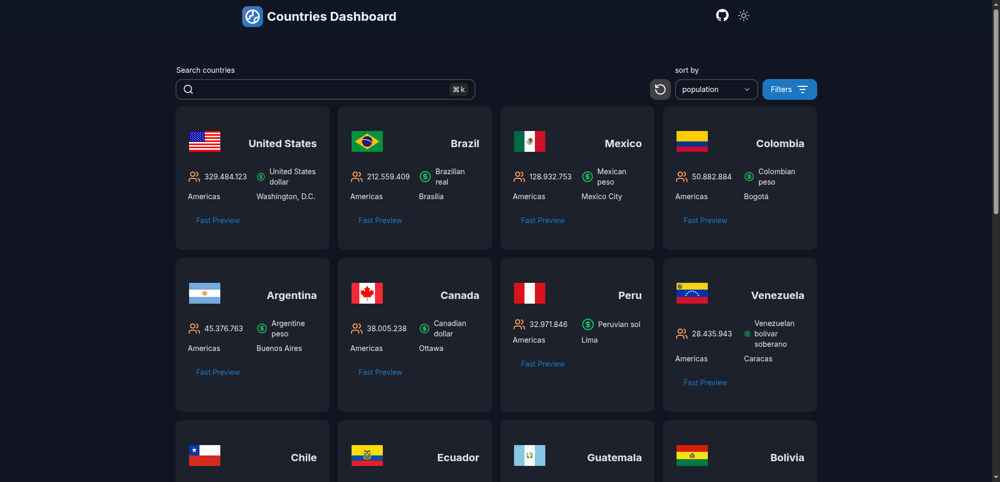

# Prueba Técnica: Desarrollo Frontend - React, Next.js, TypeScript y Heroui




- [Descripción](#descripción)
- [Tecnologías Utilizadas](#tecnologías-utilizadas)
- [Funcionalidades Implementadas](#funcionalidades-implementadas)
- [APIs Utilizadas](#apis-utilizadas)
- [Diseño](#diseño)
- [Instalación y Ejecución](#instalación-y-ejecución)
- [Estructura del Proyecto](#estructura-del-proyecto)

# Descripción

La aplicación es un dashboard dinámico y atractivo que presenta información detallada de países obtenidos de una API pública. Permite a los usuarios explorar, buscar, filtrar y ordenar países, además de ofrecer una experiencia visual agradable con soporte para modo oscuro.
## Tecnologías Utilizadas

-   **React JS** (19)
-   **Next.js** (15)
-   **TypeScript** (.tsx)
-   **Heroui** (2) - Librería de componentes UI.
-   **Axios** - Para realizar las peticiones HTTP a las APIs.

## Funcionalidades Implementadas

-   **Visualización de Países:** Muestra una lista/cuadrícula de países con información clave.
-   **Detalles del País:** Al seleccionar un país, se muestra información adicional como población, capital, moneda e idiomas oficiales.
-   **Búsqueda:** Campo de búsqueda para encontrar países por nombre. [Source 9, 17]
-   **Filtro por Región:** Permite filtrar los países según su región (Ej: Europa, Asia, Américas, etc.).
-   **Paginación:** Navegación entre páginas para explorar la lista completa de países.
-   **Ordenación:** Botones para ordenar los países por nombre, población o moneda.
-   **Modo Oscuro (Dark Mode):** Soporte nativo de Next.js para cambiar entre tema claro y oscuro de forma dinámica.
-   **Carga Diferida (Lazy Loading):** Las imágenes de las banderas se cargan eficientemente mediante lazy loading.
-   **Diseño Responsivo:** La interfaz se adapta a diferentes tamaños de pantalla (móvil, tablet, escritorio).

## APIs Utilizadas

-   **RestCountries API:** Para obtener la información de los países.
    -   Todos los países: `https://restcountries.com/v3.1/all`
-   **FlagsAPI:** Para mostrar las banderas de los países.
    -   Formato URL: `https://flagsapi.com/{country_code}/{style}/{size}.png` (Ej: `https://flagsapi.com/ES/flat/64.png`)

## Diseño

-   La interfaz se basa en un prototipo diseñado en Figma, utilizando componentes de la librería **Heroui**.
-   El componente de la tarjeta (card) de país es un diseño personalizado siguiendo las especificaciones de la prueba.
-   Se utilizaron las paletas de colores especificadas en los requerimientos.

## Instalación y Ejecución

Sigue estos pasos para ejecutar el proyecto localmente:

1.  **Clona el repositorio:**
    ```bash
    git clone https://github.com/acbcdev/prueba-Tecnica-ClickPanda
    cd prueba-Tecnica-ClickPanda
    ```

2.  **Instala las dependencias:**
    ```bash
    pnpm install
    ```

3.  **Ejecuta el servidor de desarrollo:**
    ```bash
    pnpm dev
    ```

4.  Abre tu navegador y visita `http://localhost:3000` (o el puerto que indique Next.js).

## Estructura del Proyecto

El código está organizado siguiendo buenas prácticas, separando la lógica en:

-   **Components:** Componentes reutilizables de la interfaz de usuario.
-   **Controllers/:** Funciones consumo de API y utilidades generales.
-   **Pages/Views:** Estructura principal de las páginas de Next.js, incluyendo el dashboard principal.

